# E-SINIF
Bu proje Zonguldak Bülent Ecevit Üniversitesi Bilgisayar Mühendisliği Bölümü 2020 yılı bitirme projesi dersi için Engin Altuntaş tarafından hazırlanmıştır.

Projenin amacı online sınıf ortamı yaratarak öğretmen-öğrenci arasında ödev,duyuru,bilgilendirme verilerinin görüntülendiği web platformu oluşturmak.

Projenin hatasız çalıştırılabilmesi için Microsoft Azure Veri Tabanı sunucumuza programı çalıştıran kişinin ip adresi girilmesi gereklidir.Diğer türlü program çalışmayacaktır.

Kodların incelenebilmesi amacıyla bu proje paylaşılmıştır.

Projeden görseller:

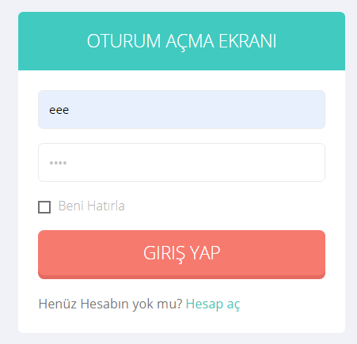
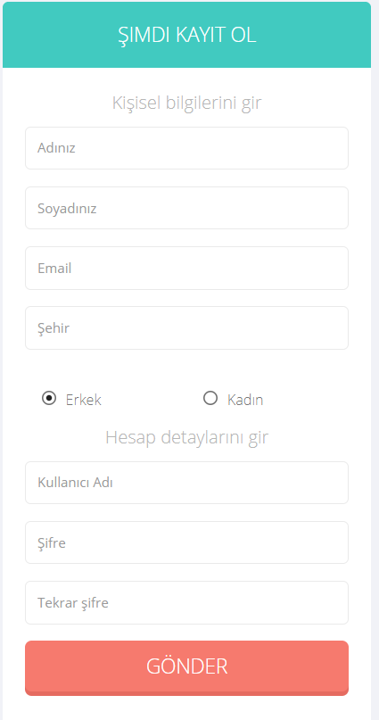
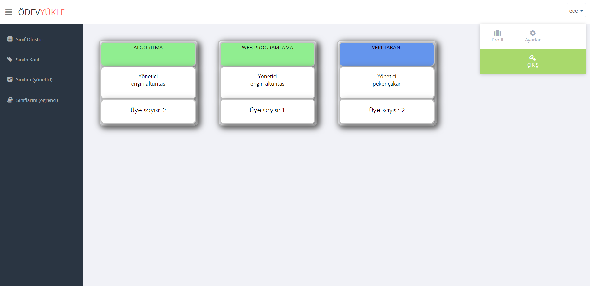
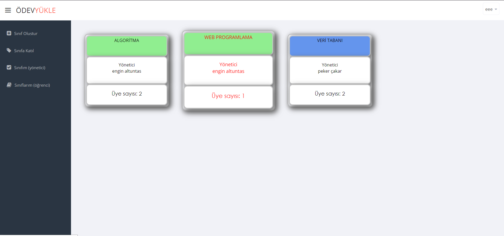
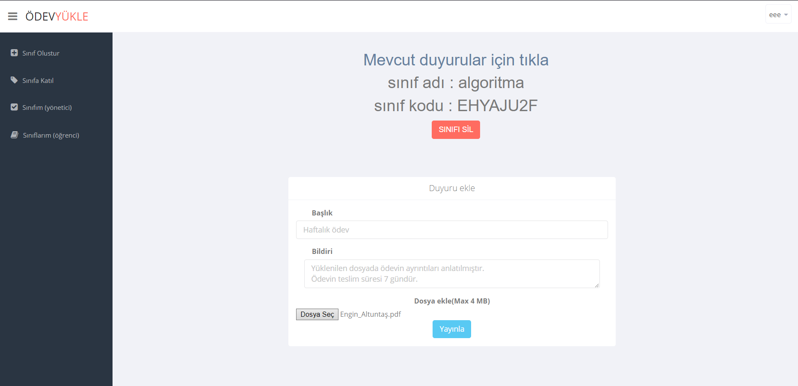
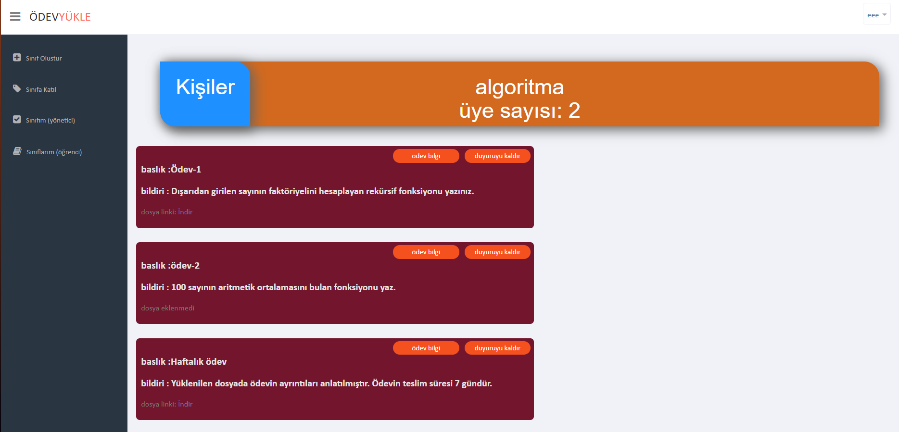
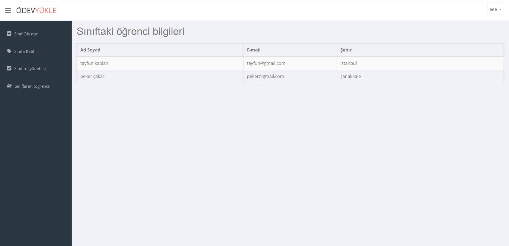
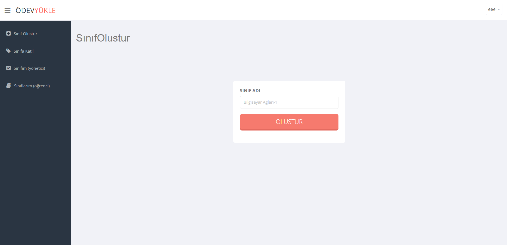
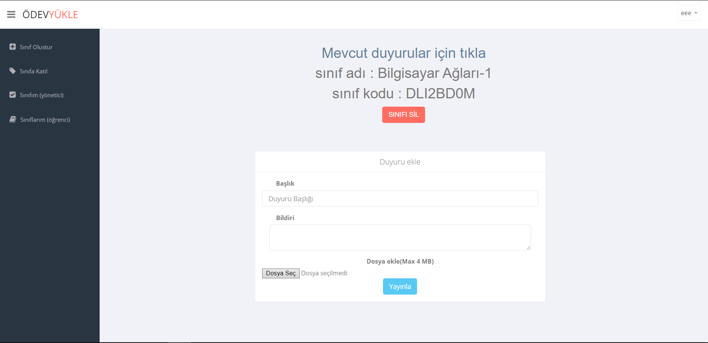

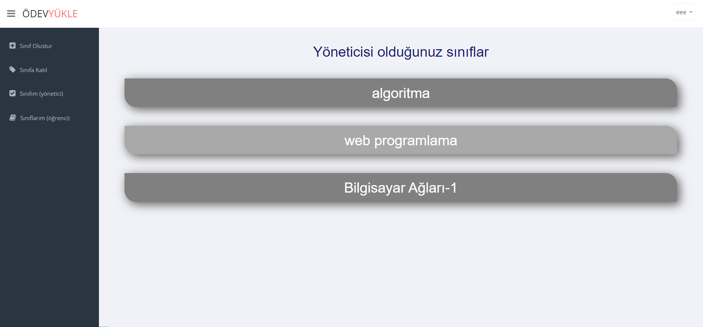
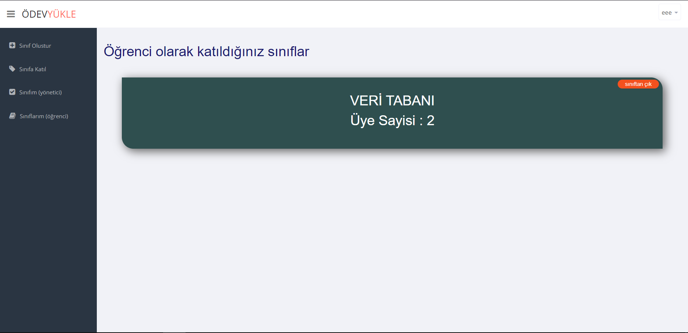
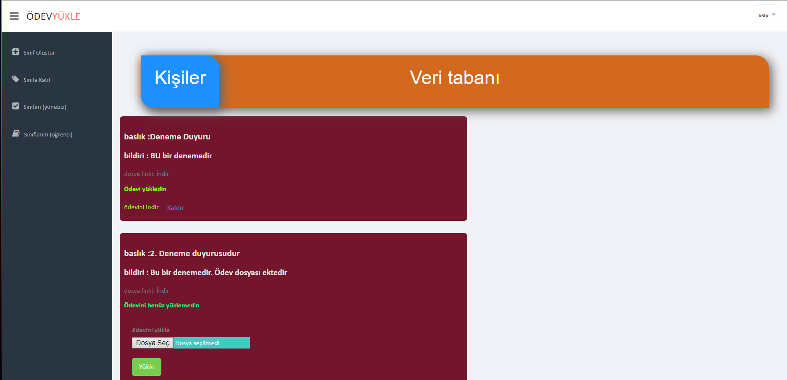
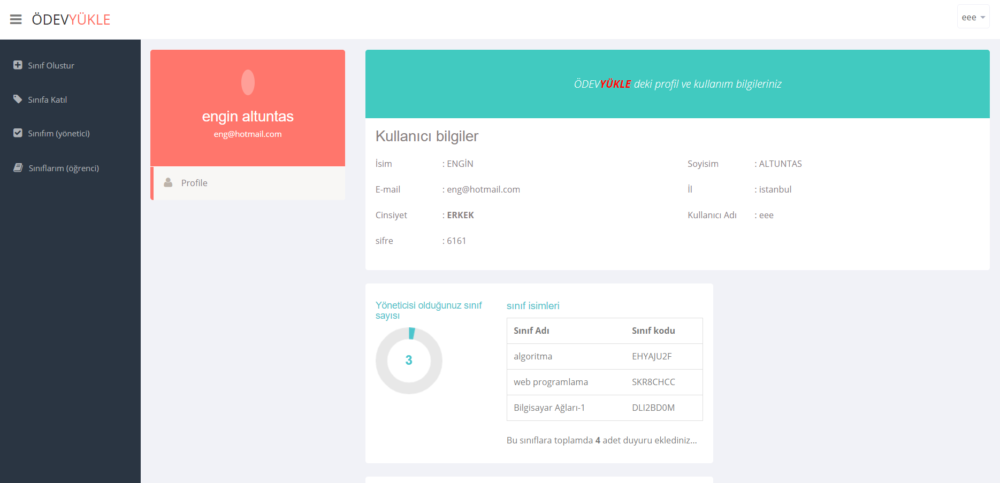
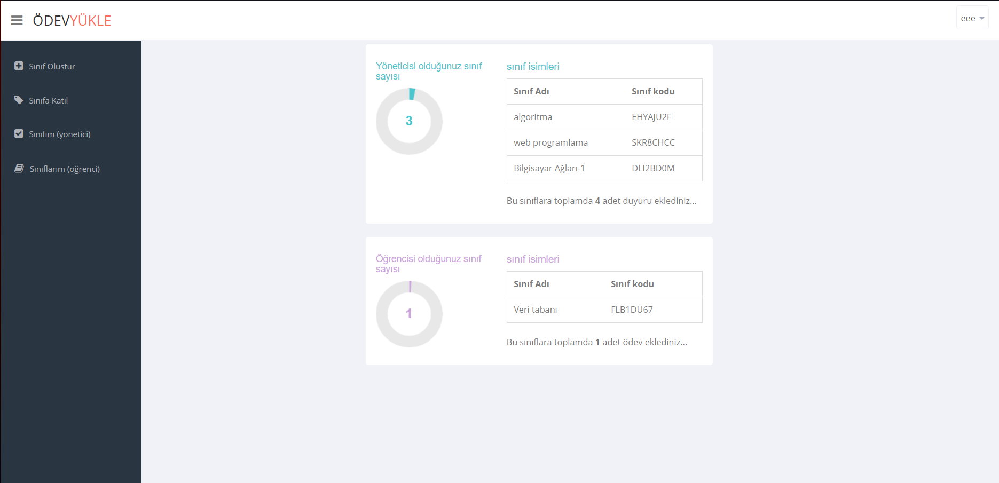
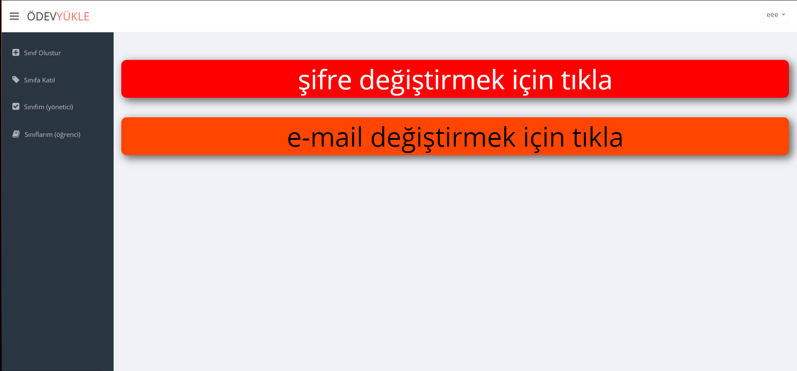
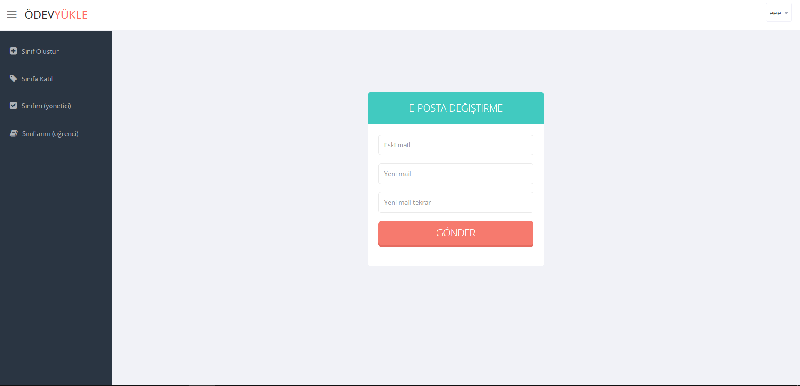
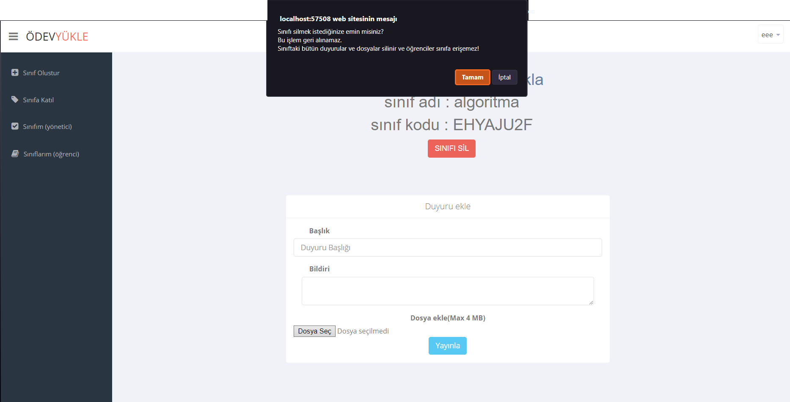
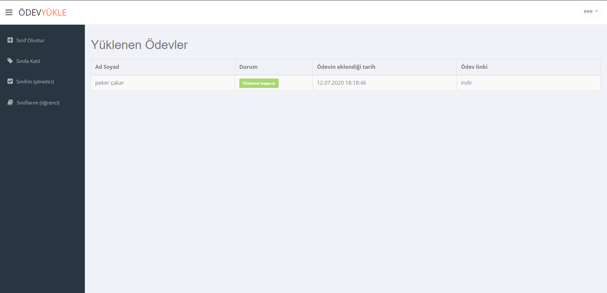
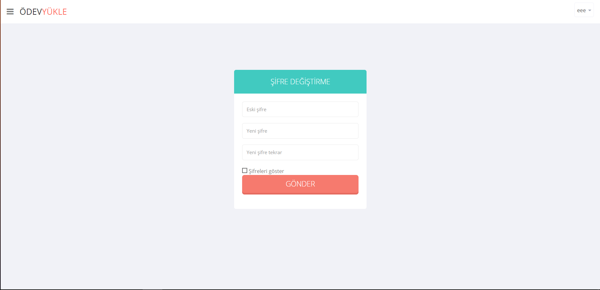
